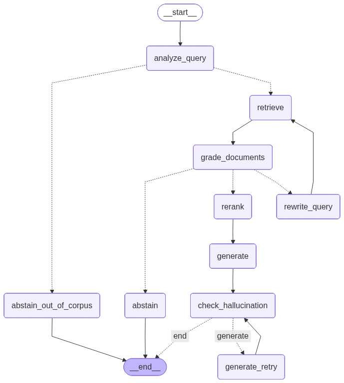

# BoE Policy Analysis — Agentic Corrective RAG


**An AI system that answers questions about Bank of England policy with a source behind every claim — and refuses when it can't.**

> A general-purpose chatbot misreads central-bank documents two ways: its training data predates the latest rate decision, and it invents vote splits and inflation figures with full confidence. This grounds every answer in 23 scraped BoE documents, and treats *knowing when to stay silent* as a core design goal.

---

### What it is

A retrieval-augmented generation (RAG) system, built as two pipelines on the **same** corpus so the design is measured, not the data:
- a **naive baseline** (fixed chunks, plain retrieval, vanilla prompt), and
- an **agentic Corrective RAG** — a LangGraph state machine that grades its own retrieved evidence, retries, and self-checks before answering.

### What it does

- **Cites everything** — each claim is tied to a specific source chunk.
- **Self-corrects** — three LLM-decided loops: abstain on out-of-scope questions *before* retrieving, rewrite-and-retry on a bad query, and regenerate if the draft answer isn't grounded.
- **Knows its limits** — a pre-retrieval **scope gate** (my original contribution) refuses out-of-corpus questions instead of guessing.
- **Proves it works** — RAGAS metrics with proper statistics: **+0.148 retrieval precision**, and **100% recall on questions that should be refused**.

---

## How it works

Solid arrows are fixed steps; **dashed arrows are decisions an LLM makes at runtime** — that's what makes it agentic rather than a fixed chain.



<details>
<summary><b>The five techniques behind it</b> (for the AI crowd)</summary>

| # | Technique | Fixes |
|---|---|---|
| 1 | **Section-aware chunking** with metadata (`date`, `speaker`, `box_id`, …) | Fixed-size splitting fragments vote tallies and Boxes |
| 2 | **LLM query rewriting** — retry once on zero relevant chunks | Retrieval failure → empty context |
| 3 | **Cohere `rerank-v3.5`** reorders top-10 → top-5 | Cosine similarity misjudges fine relevance |
| 4 | **Self-refinement loop** — hallucination check triggers a stricter regeneration | Confident, ungrounded answers |
| 5 | **Out-of-corpus scope gate** *(original)* — refuse *before* retrieving | Vanilla CRAG wastes a full retrieval before realising the question is out of scope |

*Anchors: Yan et al. 2024 (CRAG), Asai et al. 2023 (Self-RAG), Karpukhin et al. 2020.*
</details>

## Results

25-query test set, graded by a different model family (`gpt-4o-mini`) to avoid bias, with paired Wilcoxon tests, Holm–Bonferroni correction, and bootstrap CIs.

| | Baseline | Enhanced |
|---|---|---|
| Retrieval precision | 0.66 | **0.81** |
| Refuses when it should | — | **100%** |

The honest version is in the report: with n = 25 nothing reaches strict significance, and I say so rather than cherry-pick. The real insight is that **RAGAS scores what a system answers, but a corrective system's value is in what it refuses** — so I built a metric for that.

## Run it

```bash
git clone https://github.com/angel4angelov-glitch/boe-rag-project.git
cd boe-rag-project
pip install -e ".[dev]"
cp .env.example .env   # add ANTHROPIC_API_KEY, OPENAI_API_KEY, COHERE_API_KEY
```

Then run `notebooks/01 → 02 → 03` (ingest → pipelines → evaluation).

<details>
<summary><b>Or run it as a live app</b> (FastAPI + Streamlit UI)</summary>

```bash
pip install -e ".[service]" streamlit
uvicorn service.main:app --reload     # API on :8000  (Swagger at /docs)
streamlit run ui.py                   # browser UI
```
</details>

## Stack

Claude Sonnet 4 · OpenAI embeddings · ChromaDB · Cohere rerank · LangGraph · RAGAS · FastAPI · 248 tests

## Read more

[`report.pdf`](report.pdf) — full design, evaluation, and reflection · [`demo_log.pdf`](demo_log.pdf) — six worked queries · [`docs/`](docs/) — component specs

<sub>Individual project for **IB9AU0 — Generative AI & AI Applications**, MSc Financial Technology (Warwick Business School). Graded **90/100**.</sub>
